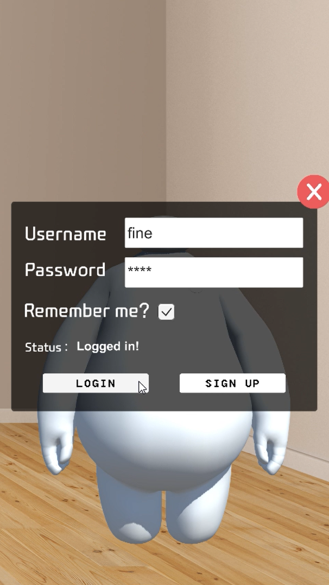
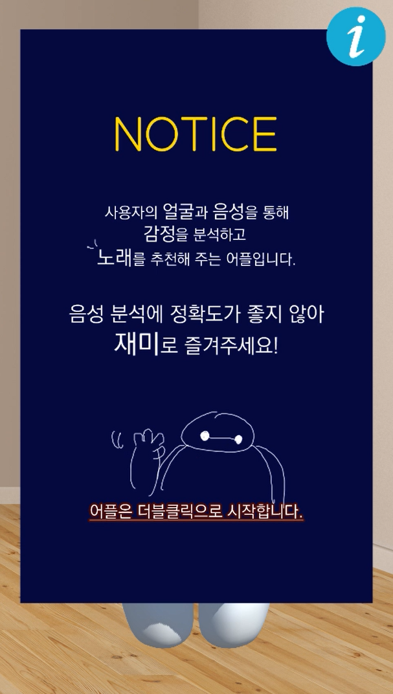
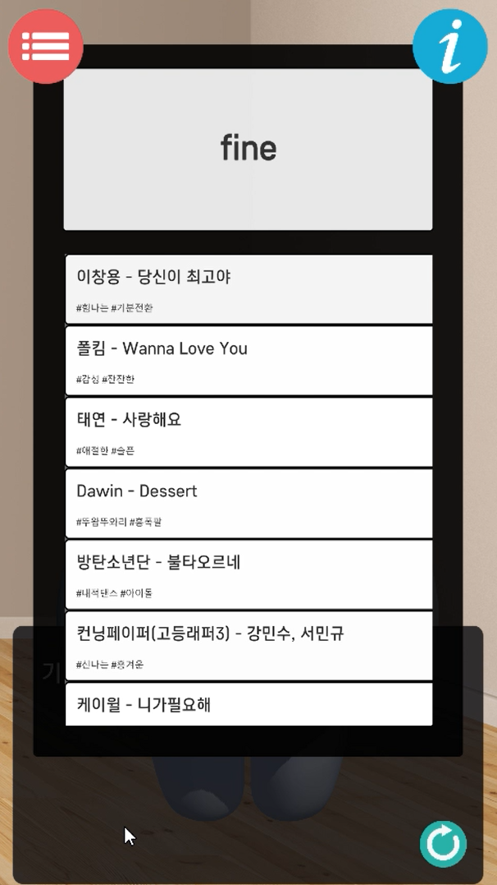
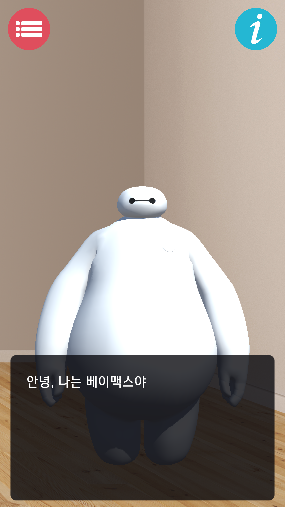
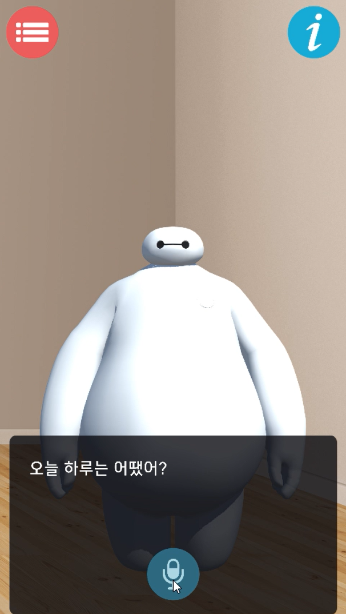
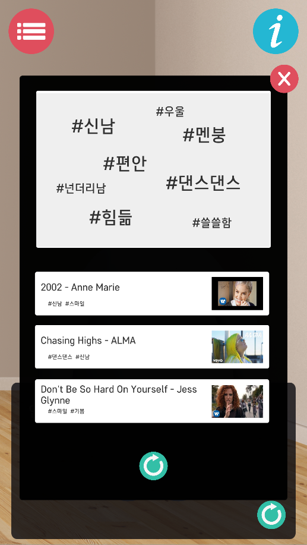

# My Mood Music
 
### 프로젝트 소개

  본 프로젝트는 이미지(사용자 표정)와 음성 데이터(사용자 음성)를 통해 사용자의 감정을 분석하고 분석 결과를 이용하여 간단한 분석 결과 설명과 함께 적절한 음악을 추천해주는 어플을 개발하는 것을 목표로 한다.
    
The project aims to develop a app that analyzes the user's feelings through images (user's facial) and voice data (user's voice) and recommends appropriate music with a brief description of the analysis results.

<br/>


### 사용 환경
Windows10 x64기반, MS visual code Editor, python 3.8 version, Unity2018 3.11 version
  
    

## 실행 방법


#### 파이썬 모듈 설치 (tensorflow, keras, librosa 등)
python3.5(64bit) 이상의 버전에서 pip을 사용하여 Django 프로젝트를 수행할 가상환경을 세팅해놓아야 한다.    

가상화면 만들기
``` 
python -m venv myenv
```

가상화면 접속
```
myenv\Script\activate
```

패키지 다운로드
`2019-cap1-2019/src/pyDjango/` 로 들어가서 `requirements.txt` 를 다운받아 명령어를 사용하여 세팅을 완료한다.    
```
pip3.6 install -r requirements.txt 
```
 

#### Django를 이용해 프로젝트를 만드는 방법

다음 링크를 참고한다.    
https://tutorial.djangogirls.org/ko/django_start_project/

또한, Visual Code에서 Django를 처음 시작할 때 튜토리얼을 보고 싶다면 다음 링크를 참고한다.
https://code.visualstudio.com/docs/python/tutorial-django


#### 얼굴 인식 감정 분석 모델 다운

https://github.com/omar178/Emotion-recognition 에서 `_mini_XCEPTION.102-0.66.hdf5`, `haarcascade_frontalface_default.xml` 을 다운받아 실행파일 디렉토리에 둔다.


#### 음성 모델 다운

https://github.com/MITESHPUTHRANNEU/Speech-Emotion-Analyzer 에서 `Emtion_Voice_Detection_Model.h5, model.json` 을 다운받아 실행파일 디렉토리에 둔다.    


#### Unity Setting
```
unity 폴더에 있는 폴더들을 다운받아 unity에 새 project를 생성하고 해당 파일들을 붙여넣고 실행을 시킨다.     
scene에 있는 start를 더블클릭 해서 실행한다.    
```


## AWS EC2에 연결해놓은 서버로 연결
http://ec2-54-180-152-15.ap-northeast-2.compute.amazonaws.com:8000/api/ 기본연결

    
    
## 로컬 서버로 연결

현재 학교에서 지원해주는 AWS를 사용중이지만, 2019년 내 기간이 지나면 쓰지 못하기 때문에 로컬에서 돌려볼 것을 권장한다.
로컬에서 돌려볼 시에 Unity에서의 파일 전송 코드의 url을 "localhost:port # "을 기본으로 바꾸어야 한다.
Unity의 Menu의 Backend Manager의 Use Production의 체크를 해제하면 된다.

    
그리고 createsuperuser 명령어를 통하여 admin 사이트에 로그인 할 수 있는 계정을 만들어야 한다.  계정설정 후 (127.0.0.1:8000/admin) 로 이동하여 로그인하면 DB 테이블을 볼 수 있다.
```
python manage.py createsuperuser  

사용자이름: mmm  
email: (enter)  
password: 1234 (비밀번호가 너무 짧다고 나옴. y를 누른다)
```


시연시켜보려면 `2019-cap1-2019_10/src/DB` 에 있는 csv 파일들을 DB 테이블에 추가해야 한다.  

DB테이블에 추가하는 방법 (shell에 접속 -> shell 스크립트에서 
`2019-cap1-2019_10/src/pyDjango/my_mood_music/test.py` 에 있는 내용의 path를 DB 폴더가 있는 path로 변경 후 붙여넣기 한다.

```
python manage.py shell
```

ex)
```
import csv
import os
path =  'C:/Users/X58/Documents/GitHub/2019-cap1-2019_10/src/DB'  # replace DB/ path
os.chdir(path)
from my_mood_music.models import Anger
with  open('anger.csv', encoding='utf-8') as csvfile:
reader = csv.DictReader(csvfile)
for row in reader :
p = Anger(music=row['music'], age=row['age_a'],link=row['link_a'], tag_1=row['tag_a1'], tag_2=row['tag_a2'])
p.save()
(enter)
```


마지막으로, 로컬 서버를 실행시키는 방법은 다음과 같다. 
`manage.py` 파일이 있는 `2019-cap1-2019_10/src/pyDjango/` 폴더로 이동해야 한다.
 
```
python manage.py runserver 0:8000
```


## 실행 화면
    
  
  

## Reference
[얼굴 인식](https://github.com/omar178/Emotion-recognition)
[음성 인식](https://github.com/MITESHPUTHRANNEU/Speech-Emotion-Analyzer) 
[어플 개발 참고](https://github.com/eamonwoortman/django-unity3d-example)


## License
GPL-2.0

## 소개 영상

[](https://youtu.be/4S6KBMRbfgc)


## 팀 소개


<h4> - 오윤정  </h4>
<p>` 20153194 <br>
  ` yuj325@kookmin.ac.kr <br>
  ` API서버 개발  </p>
  <br>
  


<h4> - 원수빈 </h4>  
<p>` 20153196   <br>
  ` dnjstnqls@kookmin.ac.kr  <br>
  ` 데이터베이스설계  </p>
   <br>
  


<h4> - 강은채  </h4>  
<p>`  20152872   <br>
  ` eunchae0280@naver.com  <br>
  ` 음성데이터를 통한 감정분석 모델 생성 및 학습     </p>
   <br>
   


<h4> - 홍자현  </h4>
<p>`  20163180   <br>
  ` 970619abc@naver.com    <br>
  ` 추천 알고리즘 구현       </p>
  <br>
  


<h4> - 박정은  </h4>
<p>`  20153180   <br>
  ` xjeunna@naver.com   <br>
  ` 3d 모델링 및 애니메이션 제작, 어플 개발     </p>
  <br>
