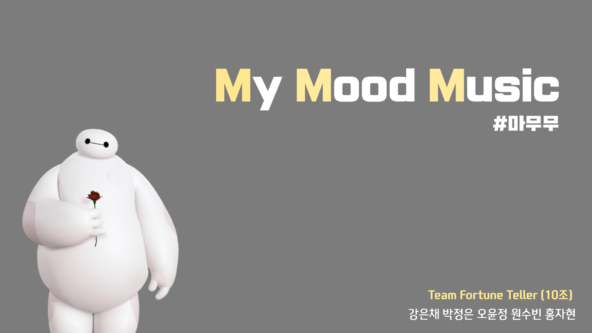

# My Mood Music


### 1. 프로젝트 소개

  본 프로젝트는 이미지(사용자 표정)와 음성 데이터(사용자 음성)를 통해 사용자의 감정을 분석하고 분석 결과를 이용하여 간단한 분석 결과 설명과 함께 적절한 음악을 추천해주는 어플을 개발하는 것을 목표로 한다.

  <br/>
  The problem of depression in modern times is getting worse and worse. Modern people who live in an overly competitive society cannot care for their feelings to survive in a desperate society.
  This lack of self-awareness makes modern people not only poor at expressing emotions, but also extremely awkward. Before the problems of depression, communication difficulties, etc. can get worse, there should be a chance to express one's feelings.
  However, it is not easy to suddenly look back on yourself and become aware of your feelings.
  Therefore, the project aims to create an application that informs users of their emotional analysis results and recommends songs based on them.
  Emotional analysis results are derived by combining the results of emotional analysis through facial recognition and the analysis of intonation through voice recognition.

### 2. 소개 영상

[](https://youtu.be/4S6KBMRbfgc)


### 3. 팀 소개


<h4> - 오윤정  </h4>
<p>` 20153194 <br>
  ` yuj325@kookmin.ac.kr <br>
  ` API서버 개발  </p>
  <br>
  


<h4> - 원수빈 </h4>  
<p>` 20153196   <br>
  ` dnjstnqls@kookmin.ac.kr  <br>
  ` 데이터베이스설계, API서버 개발    </p>
   <br>
  


<h4> - 강은채  </h4>  
<p>`  20152872   <br>
  ` eunchae0280@naver.com  <br>
  ` 음성데이터를 통한 감정분석 모델 생성 및 학습     </p>
   <br>
   


<h4> - 홍자현  </h4>
<p>`  20163180   <br>
  ` 970619abc@naver.com    <br>
  ` 추천 알고리즘 구현       </p>
  <br>
  


<h4> - 박정은  </h4>
<p>`  20153180   <br>
  ` xjeunna@naver.com   <br>
  ` 3d 모델링 및 애니메이션 제작, 어플 개발     </p>
  <br>
  

### 4. 사용법

#### <b>API Key Setting
```
Microsoft Face API에서 ID/KEY 발급
- pyDjango/api.py의 RequestFaceAPI의 key값 변경
```
<br/>

#### <b>파이썬 모듈 설치 (tensorflow, keras, librosa)

python3.5(64bit) 이상의 버전에서 pip을 사용하여 Django 프로젝트를 수행할 가상환경을 세팅해놓아야 한다.
`2019-cap1-2019/src/pyDjango/mmm_project` 로 들어가서 `requirements.txt` 를 다운받아  명령어를 사용하여 세팅을 완료한다

```bash
pip3.6 install -r requirements.txt 
```
<br/>

#### <b> Windows환경이라면 MySQL을 미리 설치

```
연동하는 것은 https://jamanbbo.tistory.com/28 이 링크를 참조한다.
start project를 하고 나서 `settings.py`를 고쳐야 한다. 
한국이라면 아래와 같다.
```

<br/>

#### <b> Django를 이용해 프로젝트를 만드는 방법

```
다음 링크를 참고한다
https://tutorial.djangogirls.org/ko/django_start_project/
```

<br/>

#### <b> 음성 모델 다운

```
https://github.com/MITESHPUTHRANNEU/Speech-Emotion-Analyzer에서 `Emtion_Voice_Detection_Model.h5, model.json` 을 다운받아 실행파일 디렉토리에 둔다 .
```

<br/>

#### <b> Unity Setting

```
unity 폴더에 있는 폴더들을 다운받아 unity에 새 project를 생성하고 해당 파일들을 붙여넣고 실행을 시킨다. scene에 있는 start를 더블클릭 해서 실행한다.
```

### 5. 기타

추가적인 내용은 자유롭게 작성하세요.
