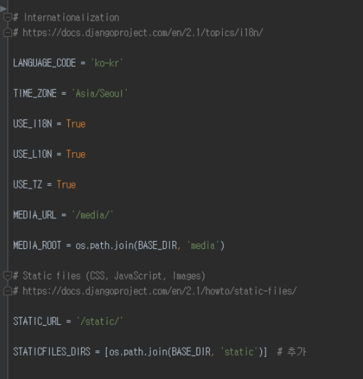

# My Mood Music


### 프로젝트 소개

  본 프로젝트는 이미지(사용자 표정)와 음성 데이터(사용자 음성)를 통해 사용자의 감정을 분석하고 분석 결과를 이용하여 간단한 분석 결과 설명과 함께 적절한 음악을 추천해주는 어플을 개발하는 것을 목표로 한다.
    
The project aims to develop a app that analyzes the user's feelings through images (user's facial) and voice data (user's voice) and recommends appropriate music with a brief description of the analysis results.

<br/>
  
    
## 실행 방법

#### API Key Setting
  
```
Microsoft Face API에서 ID/KEY 발급
- pyDjango/api.py의 RequestFaceAPI의 key값 변경
```

#### 파이썬 모듈 설치 (tensorflow, keras, librosa)
python3.5(64bit) 이상의 버전에서 pip을 사용하여 Django 프로젝트를 수행할 가상환경을 세팅해놓아야 한다.    
`2019-cap1-2019/src/pyDjango/mmm_project` 로 들어가서 `requirements.txt` 를 다운받아 명령어를 사용하여 세팅을 완료한다.    

```bash
pip3.6 install -r requirements.txt 
```

#### Windows환경이라면 MySQL을 미리 설치

연동하는 것은 https://jamanbbo.tistory.com/28 이 링크를 참조한다.    
start project를 하고 나서 `settings.py`를 고쳐야 한다.     
한국이라면 아래와 같다.   
     


#### Django를 이용해 프로젝트를 만드는 방법

다음 링크를 참고한다.    
https://tutorial.djangogirls.org/ko/django_start_project/

#### 음성 모델 다운

https://github.com/MITESHPUTHRANNEU/Speech-Emotion-Analyzer 에서 `Emtion_Voice_Detection_Model.h5, model.json` 을 다운받아 실행파일 디렉토리에 둔다.    

#### Unity Setting
```
unity 폴더에 있는 폴더들을 다운받아 unity에 새 project를 생성하고 해당 파일들을 붙여넣고 실행을 시킨다.     
scene에 있는 start를 더블클릭 해서 실행한다.    
```
    
## 기타

서버는 시연을 위해 개인용 컴퓨터에 따로 돌려놓았기 때문에 현재는 runserver가 되고 있지 않다. 
그러므로 로컬에서 돌려볼 것을 권장하며, 로컬에서 돌려볼 시에 Unity에서의 파일 전송 코드의 url을 "localhost:port # "을 기본으로 바꾸어야 한다.
Unity의 Menu의 Backend Manager의 Use Production의 체크를 해제하면 된다.
    
그리고 createsuperuser 명령어를 통하여 admin 사이트에 로그인 할 수 있는 계정을 만들어야 한다. 
데이터베이스 세팅은 settings.py 의 DATABASES를 참고하고, 
시연시켜보려면 pyDjango/mmm_project/my_mood_music/csv_data/ 에 있는 csv 파일들을 DB 테이블에 추가해야 한다.    

## 실행 화면
    
  
  

## Reference
[얼굴 인식](https://azure.microsoft.com/ko-kr/services/cognitive-services/face/)
[음성 인식](https://github.com/MITESHPUTHRANNEU/Speech-Emotion-Analyzer) 
[어플 개발 참고](https://github.com/eamonwoortman/django-unity3d-example)


## License


## 소개 영상

[](https://youtu.be/4S6KBMRbfgc)


## 팀 소개


<h4> - 오윤정  </h4>
<p>` 20153194 <br>
  ` yuj325@kookmin.ac.kr <br>
  ` API서버 개발  </p>
  <br>
  


<h4> - 원수빈 </h4>  
<p>` 20153196   <br>
  ` dnjstnqls@kookmin.ac.kr  <br>
  ` 데이터베이스설계  </p>
   <br>
  


<h4> - 강은채  </h4>  
<p>`  20152872   <br>
  ` eunchae0280@naver.com  <br>
  ` 음성데이터를 통한 감정분석 모델 생성 및 학습     </p>
   <br>
   


<h4> - 홍자현  </h4>
<p>`  20163180   <br>
  ` 970619abc@naver.com    <br>
  ` 추천 알고리즘 구현       </p>
  <br>
  


<h4> - 박정은  </h4>
<p>`  20153180   <br>
  ` xjeunna@naver.com   <br>
  ` 3d 모델링 및 애니메이션 제작, 어플 개발     </p>
  <br>
